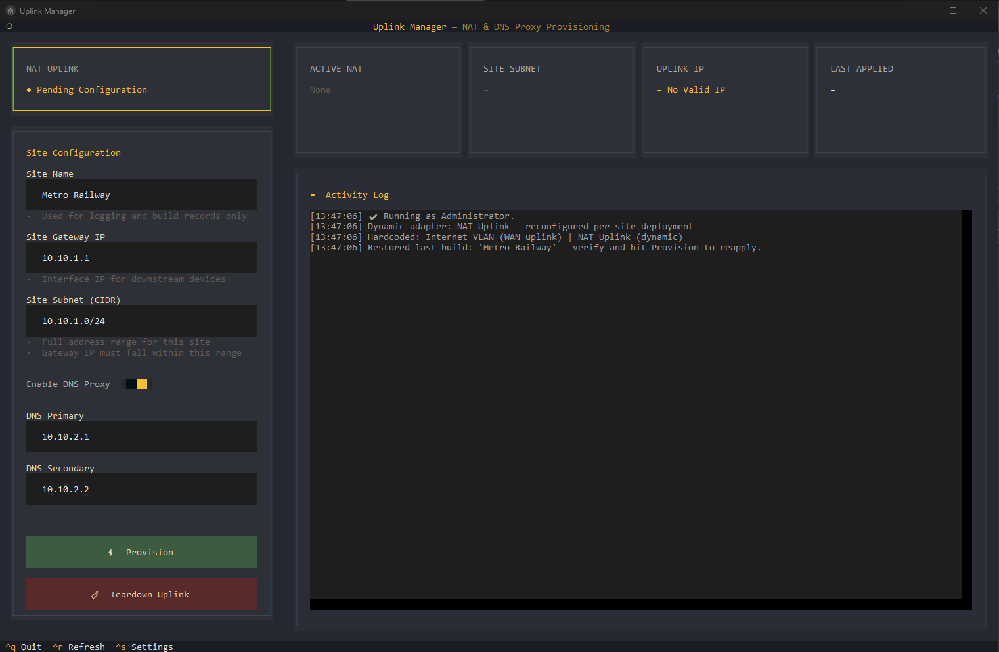

# Uplink Manager

[](https://opensource.org/licenses/MIT)

**Uplink Manager** is a Windows utility that configures WinNAT to provide internet access to downstream devices via a dedicated **NAT Uplink** adapter. It’s designed for engineers who need to quickly set up network address translation on a Windows 11 Pro VM (e.g., VMware, Hyper‑V) with a few clicks. The tool also supports a **DNS proxy** that forwards DNS requests from clients to external resolvers (like 8.8.8.8).
---

<p align="center">
  
</p>

---

## 📋 Features

- **One‑click NAT provisioning** – assign a gateway IP and subnet to the NAT Uplink adapter.
- **Teardown** – remove all NAT rules and restore the adapter to a clean state.
- **DNS Proxy** – optionally enable DNS forwarding on the NAT Uplink interface.
- **Persistent settings** – saved builds are stored in `%APPDATA%\Uplink Manager` and restored on launch.
- **Real‑time activity log** – see all PowerShell commands and their results in a scrollable log.
- **64‑bit MSI installer** – installs the application and a post‑installation configuration wizard.
- **No admin required for config storage** – user data is saved in AppData, not `Program Files`.

---

## 🚀 Installation

### 1. Download the MSI installer

Grab the latest `Uplink Manager.msi` from the [Releases](../../releases) page.

### 2. Run the installer

- **Right‑click** the MSI file and choose **Run as Administrator** (required to install to `Program Files`).
- Follow the installer wizard:
  1. **Welcome** – read the overview.
  2. **Pre‑Installation Requirements** – the installer checks for two active `vmxnet3` adapters and hardware virtualization.
  3. **VM Prerequisites Check** – verifies admin rights, Windows version, adapter count, and virtualization.
  4. **Configure Network Adapters** – choose which adapter will be the WAN (Internet VLAN) and which will be the NAT Uplink.
  5. **Confirm** – review changes.
  6. **Install** – the installer renames the selected adapters, enables Hyper‑V Services, registers the WMI NAT provider, and creates a desktop shortcut.

- After installation, a desktop shortcut to **Uplink Manager** is created. Double‑click it to launch the TUI.

---

## 🖥️ Usage

### Running Uplink Manager

- Launch the application from the desktop shortcut or Start Menu folder.
- If you are **not** running as Administrator, a warning will appear – NAT commands require elevation.

### The Main Screen

- **Left panel** – configuration form.
- **Right panel** – status cards (active NAT, subnet, uplink IP, DNS IPs) and an activity log.

### Provision a Site

1. Fill in:
   - **Site Name** (used only for logging)
   - **Site Gateway IP** (e.g., `10.10.1.1`) – this will be assigned to the NAT Uplink adapter
   - **Site Subnet (CIDR)** (e.g., `10.10.1.0/24`) – must include the gateway IP
2. (Optional) Toggle **Enable DNS Proxy** and enter one or two DNS server IPs (e.g., `10.4.100.1`). These will be added as `/32` addresses on the NAT Uplink, and the WAN adapter’s DNS will be set to `8.8.8.8`/`8.8.4.4`.
3. Click **Provision**. Confirm the action.
4. The log will show the progress in real time. When complete, the status cards update.

### Teardown

- Click **Teardown Uplink**. Confirm to remove **all** NAT rules and clear all IP addresses from the NAT Uplink adapter.

### Settings

- Press `Ctrl+S` (or use the footer bar) to open the Settings modal. Here you can:
  - Enable **verbose logs** (show full PowerShell output)
  - Toggle **auto refresh** and set the refresh interval for the status cards
- Settings are saved in `%APPDATA%\Uplink Manager\nat_settings.json`.

---

## 🔨 Building from Source

### Prerequisites

- Python 3.11 or later
- [Textual](https://textual.textualize.io/) – `pip install textual`
- [PyInstaller](https://pyinstaller.org/) – `pip install pyinstaller`
- Windows 10/11 (the application uses Windows‑specific APIs)

### Steps

1. Clone the repository:
   ```bash
   git clone https://github.com/yourusername/Uplink-Manager.git
   cd Uplink-Manager
